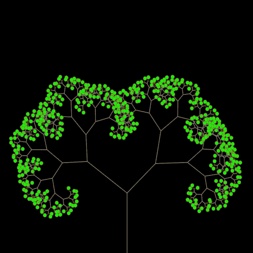

= Forest on iOS

This is a simple project to learn Swift on iOS and macOS.

The project will use SpriteKit and SwiftUI to create a simple fractal tree.
In the following I'll go deeper into the physical aspects of trees with SpriteKit or may transform the project to SceneKit.
May be finally there is a real forest generation.

